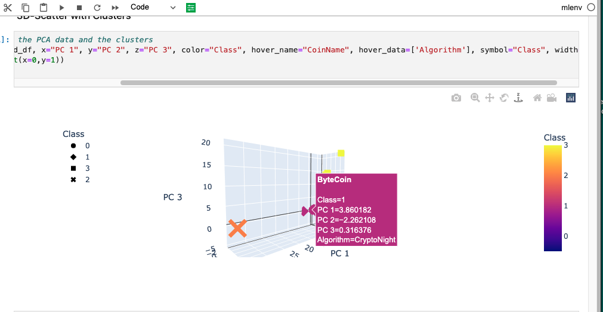

# Cryptocurrencies

## Project overview
### Preprocess data to remove unnecessary columns as well as rows with null values

#### Remove all cryptocurrencies that aren’t trading.
#### Remove all cryptocurrencies that don’t have an algorithm defined.
#### Remove the IsTrading column.
#### Remove all cryptocurrencies with at least one null value.
#### Remove all cryptocurrencies without coins mined.
#### Store the names of all cryptocurrencies on a DataFramed named coins_name, and use the crypto_df.index as the index for this new DataFrame.
#### Remove the CoinName column.
#### Create dummies variables for all of the text features, and store the resulting data on a DataFrame named X.
#### Use the StandardScaler from sklearn (Links to an external site.) to standardize all of the data from the X DataFrame. Remember, this is important prior to using PCA and K-means algorithms.Remove the descriptive column (coin name) in order to run unsupervised ML on the data
### Use PCA to determine the best number of K values
#### Reduced Data Dimensions Using PCA
#### Used the PCA algorithm from sklearn (Links to an external site.) to reduce the dimensions of the X DataFrame down to three principal components.
#### Created the DataFrame named “pcs_df” that includes the following columns: PC 1, PC 2, and PC 3. Use the crypto_df.index as the index for this new DataFrame.
### Clustering Cryptocurrencies Using K-means
#### Used the KMeans algorithm from sklearn to cluster the cryptocurrencies using the PCA data, using an elbow curve to find the best value for K.
#### Ran the K-means algorithm to predict the K clusters for the cryptocurrencies’ data.
#### Created a new DataFrame named “clustered_df,” that includes the following columns: Algorithm, ProofType, TotalCoinsMined, TotalCoinSupply, PC 1, PC 2, PC 3, CoinName, and Class.
### Visualize Results
#### Created a 3D scatter plot using Plotly Express to plot the clusters using the clustered_df DataFrame.

#### Created a data table with all the current tradable cryptocurrencies.

#### Created a scatter plot using hvplot.scatter to present the clustered data about cryptocurrencies.
